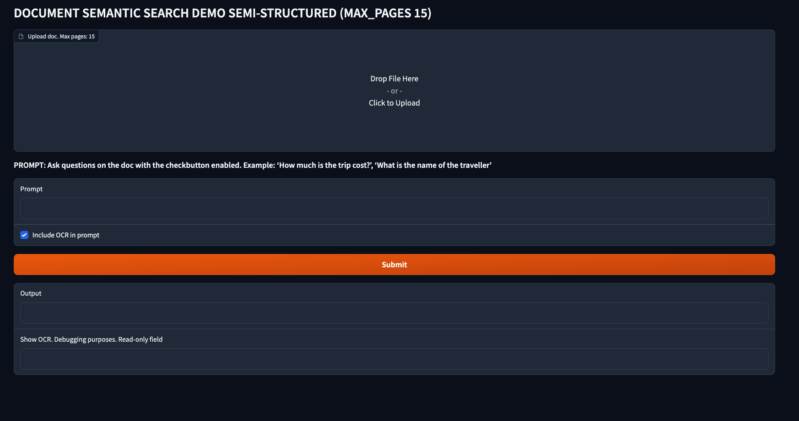

# Q&A on unstructured documents with Vertex AI LLM and Document AI OCR

The repo includes a [Gradio app](https://gradio.app/) to show the combined capabilities of Vertex LLM models and Google Cloud Document AI OCR to implement a semantic search on unstructured documents.

> NOTE: Uploaded documents should be **less than 15 pages** and **less than 8192 tokens**.
     


    
## Document AI OCR

The first step is to load the document. While you can use `PyPDF` to load and split a document either stored locally or remote, if the document is coming from a photo or scanning, it will not detect anything even if the extension is `.pdf`.

So, to extract the text from a photo or a scanned documents, you must use OCR tools like Document AI OCR. [Google Cloud Document AI](https://cloud.google.com/document-ai/docs) is a document understanding solution that takes unstructured data (e.g. documents, emails, invoices, forms, etc) and makes the data easier to understand, analyze, and consume. One of the pre-trained models performs **Optical Character Recognition (OCR)**, which is the one we will use in this post. According to [this paper](http://dx.doi.org/10.1007/s42001-021-00149-1), Document AI OCR from Google outperforms other OCR solutions available either open-source or commercial.

Document AI OCR parser supports online and batch processing. In this sample, we will use online and limit is set by the Document AI OCR online/synchronous processing which is [15 pages](https://cloud.google.com/document-ai/quotas#general_processors). Additionally, there is also the limit of [8192 max input tokens](https://cloud.google.com/vertex-ai/docs/generative-ai/learn/models#foundation_models) by the `text-bison@001`model.


## User managed service account for Cloud Run

Since the application is deployed in Cloud Run, it uses the permissions of the compute service account by default. It's recommended to use a separate service account for minimum permissions. To do that, [create the service account with impersonation](https://cloud.google.com/run/docs/securing/service-identity) the and the following **three extra roles:** `roles/aiplatform.user` to call the prediction, `roles/documentai.apiUser` to call the OCR parser and `roles/logging.logWriter` to be able to write the logs.

```sh
# Create service account
gcloud iam service-accounts create cloud-run-llm \
    --description="Service account to call LLM models from Cloud Run" \
    --display-name="cloud-run-llm"

# add aiplatform.user role 
gcloud projects add-iam-policy-binding argolis-rafaelsanchez-ml-dev \
    --member="serviceAccount:cloud-run-llm@argolis-rafaelsanchez-ml-dev.iam.gserviceaccount.com" \
    --role="roles/aiplatform.user"

# add logging.logWriter role
gcloud projects add-iam-policy-binding argolis-rafaelsanchez-ml-dev \
    --member="serviceAccount:cloud-run-llm@argolis-rafaelsanchez-ml-dev.iam.gserviceaccount.com" \
    --role="roles/logging.logWriter"

# add documentai.apiUser role
gcloud projects add-iam-policy-binding argolis-rafaelsanchez-ml-dev \
    --member="serviceAccount:cloud-run-llm@argolis-rafaelsanchez-ml-dev.iam.gserviceaccount.com" \
    --role="roles/documentai.apiUser"

# add permission to impersonate the sa (iam.serviceAccounts.actAs), since this is a user-namaged sa
gcloud iam service-accounts add-iam-policy-binding \
    cloud-run-llm@argolis-rafaelsanchez-ml-dev.iam.gserviceaccount.com \
    --member="user:admin@rafaelsanchez.altostrat.com" \
    --role="roles/iam.serviceAccountUser"
```


## Build and deploy in Cloud Run

To build and deploy the [Gradio app](https://gradio.app/) in [Cloud Run](https://cloud.google.com/run/docs/quickstarts/deploy-container), execute the following commands.

Note authentication is disabled and the service account in the one configured earlier:

```sh
gcloud auth configure-docker europe-west4-docker.pkg.dev
gcloud builds submit --tag europe-west4-docker.pkg.dev/argolis-rafaelsanchez-ml-dev/ml-pipelines-repo/docai-transformers
gcloud run deploy docai-transformers --port 7860 --image europe-west4-docker.pkg.dev/argolis-rafaelsanchez-ml-dev/ml-pipelines-repo/docai-transformers --service-account=cloud-run-llm@argolis-rafaelsanchez-ml-dev.iam.gserviceaccount.com --allow-unauthenticated --region=europe-west4 --platform=managed  --project=argolis-rafaelsanchez-ml-dev
```


## References

[1] YouTube video: [How to use Document AI](https://www.youtube.com/watch?v=9izcbNYmP8M)     
[2] Paper: [OCR with Tesseract, Amazon Textract, and Google Document AI: a benchmarking experiment](http://dx.doi.org/10.1007/s42001-021-00149-1)    
[3] YouTube video: [Generative AI on Google Cloud](https://youtu.be/Q1zF9pF6flw)      
[4] YouTube video: [Build, tune, and deploy foundation models with Vertex AI](https://youtu.be/yg2yHIKQ7oM)     
[5] YouTube video: [Build, tune, and deploy foundation models with Generative AI Support in Vertex AI](https://www.youtube.com/watch?v=-2rQ_AcQMF8)    
[6] Documentation: [Available models in Generative AI Studio](https://cloud.google.com/vertex-ai/docs/generative-ai/learn/models)     
